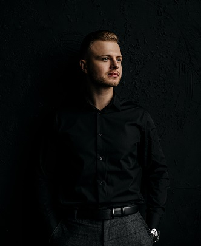

# **ALEKSEY EROH**
###_Junior Frontend Developer_



## **CONTACT DETAILS:**

- Phone: +79858216869
- E-mail: alekseyeroh@gmail.com
- Telegram: [alekseyeroh](https://t.me/alekseyeroh)
- GitHub: [lehaeroh](https://github.com/lehaeroh)

---

## **ABOUT ME:**

I am 27 years old. I am a creative, communicative, organised and confident future front-end developer. I have experience in media industry, music production, design industry, mechanical engineering and trade. I have my own musical project. I am patient and good at time management. My goal is to get the necessary knowledge as soon as possible, which will allow me to become a front-end developer in order to realize my potential and create useful things for the whole world.

---

## **SKILLS:**

* HTML
* CSS (Bootstrap Basics)
* JavaScript
* Java
* Git, GitHub, GitLab
* IntelliJ IDEA, VS Code
* Figma

---

## **CODE EXAMPLE:**

```
function sum (number, numberOfPower) {
  let a = 1;
  let result = 0;
    for (let i = 0; i <= number; i++) {
       result += a;
       a *= numberOfPower;
    }
  return result;
}
```

---

### **EXPERIENCE:**

* Engineer of production technical department, Minsk (2015-2018)
* Engineer by Siemens Systems / Operate Desigo Insight, Moscow (2018 - now)

---

### **EDUCATION:**

Belarusian National Technical University
Faculty of TECHNICAL OPERATION OF AUTOMOBILES, Minsk (2012-2018)

## **COURSES:**

* JBORN «Java» (in progress)
* RS Schools Course «JavaScript/Front-end. Stage 0» (in progress)
* RS School Course «nodeJS» (in progress)

---

## **LANGUAGE:**

* Russian - native
* English - B1
* Polish - B1

---

## **PROJECTS:**

* [Denis Novik Portfolio]()

* [Development assistance]()

* [Konstrukt]()

* [Revo]()